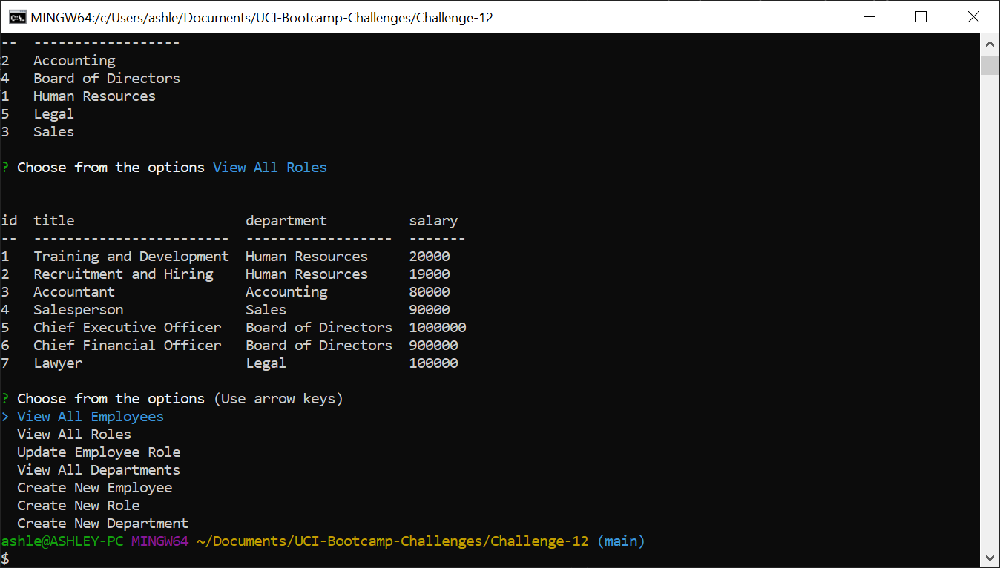

# SQL Employee Tracker

## Description
My task was to create a command-line application to manage a company's employee database using Node.js, Inquirer, and MySQL. Using Inquirer, the user will enter their input and they are presented with the option to view all employees, roles, and departments. They can also create and update employees, roles, and departments. 

## Video Link

[Video Link](https://drive.google.com/file/d/1z_7NVVEOowrmbyMlogpmh83hokTwT5iP/view)

## Screenshot
